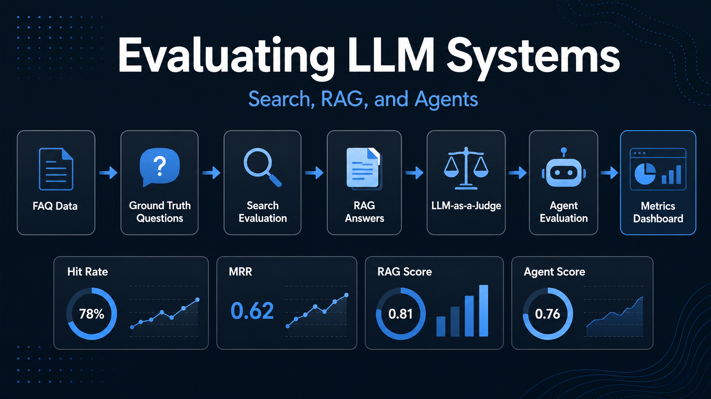

# LLM Evaluation Lab



This project follows Module 4 of LLM Zoomcamp.

The goal is to evaluate the systems built in the earlier modules:

```text
search -> RAG -> agent
```

The project answers these questions:

```text
How good is the search system?
Did tuning improve retrieval?
How good are the RAG answers?
Can an LLM judge the RAG answers?
How good are the agent answers and tool calls?
How much did the evaluation cost?
```

## Module Concepts Covered

This project follows the Module 4 course flow:

```text
load FAQ data
generate ground truth questions
evaluate search with Hit Rate and MRR
tune search parameters
generate RAG answers
judge RAG answers with LLM-as-a-judge
evaluate agent answers and tool-call trajectories
save outputs for comparison
```

The core evaluation idea is:

```text
A -> Q -> A'
```

Where:

```text
A  = original FAQ answer
Q  = generated question from that answer
A' = answer generated by RAG or agent
```

Because each generated question is linked to the original FAQ document, we can check whether search, RAG, and the agent are working correctly.

## Project Structure

```text
evaluation-lab/
├── README.md
├── .gitignore
├── code/
│   ├── ingest.py
│   ├── rag_helper.py
│   ├── evaluation_utils.py
│   └── test_setup.py
├── data/
│   ├── ground_truth-new.csv
│   ├── question-boost-results.csv
│   ├── search-tuning-results.csv
│   ├── rag-answers-new.csv
│   ├── rag-evaluations-new.csv
│   ├── agent-answers.csv
│   └── agent-evaluations.csv
├── notebooks/
│   ├── 01_generate_ground_truth.ipynb
│   ├── 02_search_evaluation.ipynb
│   ├── 03_search_tuning.ipynb
│   ├── 04_generate_rag_answers.ipynb
│   ├── 05_llm_as_judge.ipynb
│   └── 06_agent_evaluation.ipynb
└── reports/
    ├── search_metrics.md
    ├── rag_evaluation.md
    ├── rag_judge_metrics.md
    └── agent_evaluation.md
```

## Setup

Run commands from the project root:

```bash
cd "/Users/daniel/Documents/Projects/AI  Engineering Tools/datatalks/llm/zoomcamp-llm-2026"
```

Install dependencies with `uv`:

```bash
UV_CACHE_DIR=.uv-cache uv sync
```

Register the notebook kernel:

```bash
UV_CACHE_DIR=.uv-cache uv run python -m ipykernel install --user \
  --name zoomcamp-llm-2026 \
  --display-name "Python (zoomcamp-llm-2026)"
```

In VS Code, select this kernel:

```text
Python (zoomcamp-llm-2026)
```

If VS Code only shows `.venv`, make sure it points to:

```text
zoomcamp-llm-2026/.venv/bin/python
```

## Environment Variables

Create a `.env` file in the project root:

```text
zoomcamp-llm-2026/.env
```

It should contain:

```text
OPENAI_API_KEY=your_api_key_here
```

The notebooks load the key from:

```text
zoomcamp-llm-2026/.env
```

The `.env` file is ignored by Git and should not be pushed.

## Run Order

Run the notebooks in this order:

```text
notebooks/01_generate_ground_truth.ipynb
notebooks/02_search_evaluation.ipynb
notebooks/03_search_tuning.ipynb
notebooks/04_generate_rag_answers.ipynb
notebooks/05_llm_as_judge.ipynb
notebooks/06_agent_evaluation.ipynb
```

## Notebook Purpose

```text
01_generate_ground_truth.ipynb
Generate test questions from FAQ answers.

02_search_evaluation.ipynb
Evaluate the baseline search system with Hit Rate and MRR.

03_search_tuning.ipynb
Try different search boosts and choose better retrieval settings.

04_generate_rag_answers.ipynb
Run the tuned RAG system on the generated ground truth questions.

05_llm_as_judge.ipynb
Use an LLM judge to compare RAG answers with the original FAQ answers.

06_agent_evaluation.ipynb
Run an agent, capture its tool calls, and judge both answer quality and trajectory quality.
```

## Data Files

```text
data/ground_truth-new.csv
Generated questions and the document ID each question came from.

data/question-boost-results.csv
Search evaluation results for different question boost values.

data/search-tuning-results.csv
Full search tuning grid results.

data/rag-answers-new.csv
RAG answers generated for the ground truth questions.

data/rag-evaluations-new.csv
LLM-as-a-judge results for the RAG answers.

data/agent-answers.csv
Agent answers plus tool-call trajectories.

data/agent-evaluations.csv
LLM-as-a-judge results for agent answers and tool calls.
```

## Reports

```text
reports/search_metrics.md
Search baseline and tuned retrieval metrics.

reports/rag_evaluation.md
RAG answer generation summary and cost.

reports/rag_judge_metrics.md
RAG answer quality scores from the LLM judge.

reports/agent_evaluation.md
Agent answer and trajectory evaluation summary.
```

## Final Results

Search baseline:

```text
Hit Rate: 0.7734
MRR: 0.6204
```

Search after tuning:

```text
Question boost: 3.0
Answer boost: 10.0
Section boost: 0.5
Hit Rate: 0.9203
MRR: 0.7898
```

RAG answer generation:

```text
Questions processed: 565
Total cost: 0.1069
```

RAG LLM-as-a-judge:

```text
Total answers judged: 565
Good answers: 528
Bad answers: 37
Good rate: 93.45%
Judge cost: 0.0660
```

Agent evaluation:

```text
Agent answers generated: 50
Good answers: 43/50
Good trajectories: 48/50
Agent generation cost: 0.0648
Agent judge cost: 0.0088
```

## Code Helpers

```text
code/ingest.py
Loads FAQ data and builds the minsearch index.

code/rag_helper.py
Contains the base RAG class: search, context building, prompt building, and LLM call.

code/evaluation_utils.py
Contains evaluation helpers for cost calculation, structured LLM calls, Hit Rate, MRR, and RAG with usage.

code/test_setup.py
Small setup check for imports and data loading.
```

## Git Ignore Rules

The project ignores local files that should not be pushed:

```text
.env
.venv/
.uv-cache/
__pycache__/
*.pyc
.ipynb_checkpoints/
```

This keeps secrets, virtual environments, cache files, and notebook checkpoints out of GitHub.
