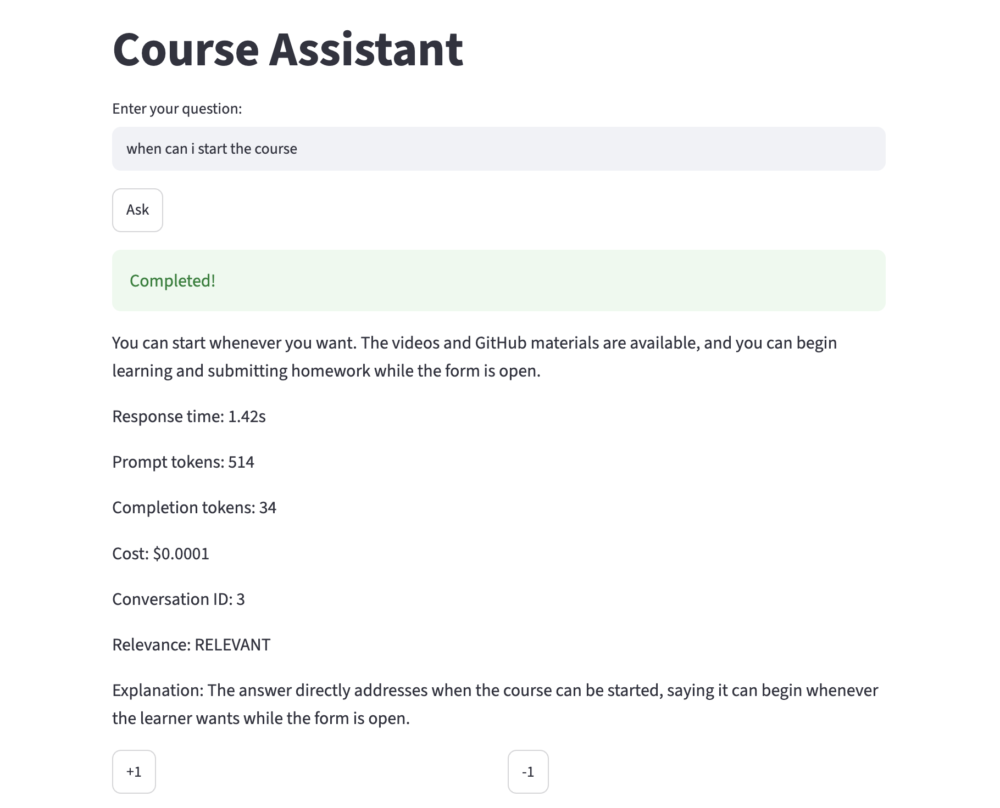
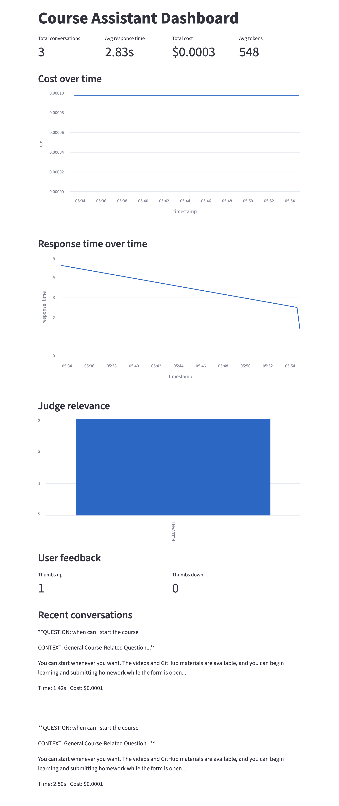
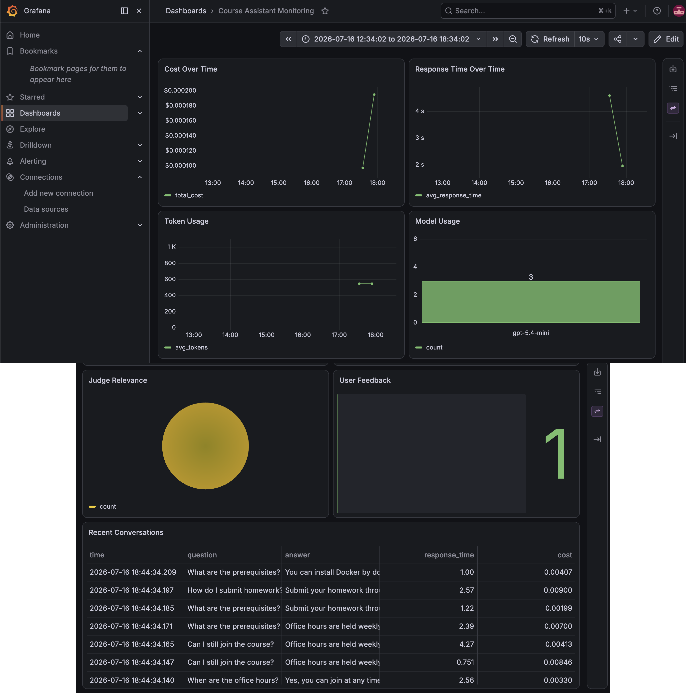

# Course Assistant Monitoring Lab

This project is the Module 5 monitoring project for the LLM Zoomcamp course.

It builds a small monitored RAG assistant that can answer course questions, save every interaction, collect feedback, and show monitoring metrics in dashboards.

## What This Project Does

The project follows the Module 5 lesson flow:

```text
question
-> RAG search
-> prompt
-> LLM answer
-> metrics
-> PostgreSQL
-> feedback
-> dashboard
```

It tracks:

- response time
- prompt tokens
- completion tokens
- total tokens
- estimated cost
- question
- answer
- prompt
- model
- user feedback
- LLM judge relevance

## Project Files

```text
monitoring-lab/
|-- Makefile
|-- Dockerfile
|-- docker-compose.yaml
|-- grafana/
|   |-- dashboards/
|   |   `-- course-assistant-monitoring.json
|   `-- provisioning/
|       |-- dashboards/
|       |   `-- dashboard.yaml
|       `-- datasources/
|           `-- postgres.yaml
|-- ingest.py
|-- rag_helper.py
|-- assistant.py
|-- app.py
|-- metrics.py
|-- db_init.py
|-- db_save.py
|-- db_query.py
|-- db_feedback.py
|-- dashboard.py
|-- judge.py
|-- generate_data.py
|-- images/
|   |-- chat-app.png
|   |-- streamlit-dashboard.png
|   `-- grafana-dashboard.png
`-- reports/
    `-- monitoring-summary.md
```

## Environment

This project uses the shared course environment from the course root.

Do not create a separate `.venv`, `.env`, `pyproject.toml`, or `uv.lock` inside `monitoring-lab`.

The course root `.env` should contain:

```text
OPENAI_API_KEY=...
POSTGRES_HOST=localhost
POSTGRES_DB=course_assistant
POSTGRES_USER=user
POSTGRES_PASSWORD=password
```

Do not commit `.env`.

## Run With Docker Compose

From this folder, start the full stack:

```bash
docker compose up -d
```

This starts:

- PostgreSQL on `5432`
- Streamlit chat app on `8501`
- Grafana on `3001`

Initialize the database tables:

```bash
uv run python db_init.py
```

Open the chat app:

```text
http://localhost:8501
```

Open Grafana:

```text
http://localhost:3001
```

Stop the stack:

```bash
docker compose down
```

## Run Locally

Start PostgreSQL first, then initialize the database:

```bash
uv run python db_init.py
```

Run the command-line assistant:

```bash
make run
```

Run the Streamlit chat app:

```bash
make chat
```

Run the Streamlit monitoring dashboard:

```bash
make dashboard
```

## Test The App

Ask a question such as:

```text
Can I still join the course?
```

The app should show:

- answer
- response time
- prompt tokens
- completion tokens
- cost
- conversation ID
- judge relevance
- judge explanation
- feedback buttons

After asking questions, check the dashboards.

## Dashboard Levels

The project captures monitoring at three levels.

Level 1: chat app output

```text
app.py
```

The chat app shows immediate information after one user question:

- answer
- response time
- token usage
- cost
- conversation ID
- judge relevance
- user feedback buttons

Level 2: Streamlit monitoring dashboard

```text
dashboard.py
```

The Streamlit dashboard summarizes saved conversations:

- total conversations
- average response time
- total cost
- average tokens
- cost over time
- response time over time
- judge relevance
- user feedback
- recent conversations

Level 3: Grafana dashboard

```text
Grafana + PostgreSQL
```

Grafana gives a richer SQL-based view of the same monitoring data:

- response time over time
- cost over time
- token usage
- model usage
- judge relevance distribution
- user feedback distribution
- recent conversations table

## Screenshots

Add dashboard screenshots to the `images/` folder.

Chat app:



Streamlit monitoring dashboard:



Grafana dashboard:



## Grafana

Grafana reads monitoring data from PostgreSQL.

The PostgreSQL data source and dashboard are provisioned automatically from:

```text
grafana/provisioning/datasources/postgres.yaml
grafana/provisioning/dashboards/dashboard.yaml
grafana/dashboards/course-assistant-monitoring.json
```

Useful panels include:

- response time over time
- cost over time
- token usage
- model usage
- judge relevance
- user feedback
- recent conversations

When Grafana connects to PostgreSQL through Docker Compose, use:

```text
Host: postgres:5432
Database: course_assistant
Username: user
Password: password
TLS/SSL: disable
```

The manual settings above are useful for learning. In this project, the Docker Compose setup loads them automatically.

## Generate Synthetic Data

Synthetic data helps test the dashboards when there are not many real conversations yet.

Run:

```bash
uv run python generate_data.py
```

Stop it with `Ctrl+C`.

## Final Report

The project summary is in:

```text
reports/monitoring-summary.md
```

It explains what was built and what was learned from the monitoring module.

## Troubleshooting

If Docker build fails because of a lockfile platform error, rebuild the Streamlit image:

```bash
docker compose build streamlit
docker compose up -d streamlit
```

If PostgreSQL connection fails, check that the containers are running:

```bash
docker compose ps
```

If the Streamlit app does not update after code changes, rebuild and restart:

```bash
docker compose build streamlit
docker compose up -d streamlit
```
